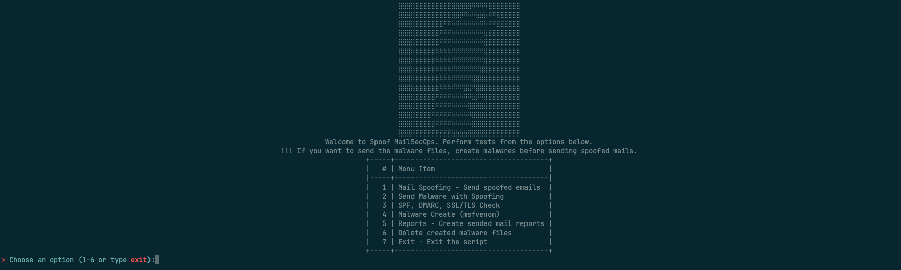
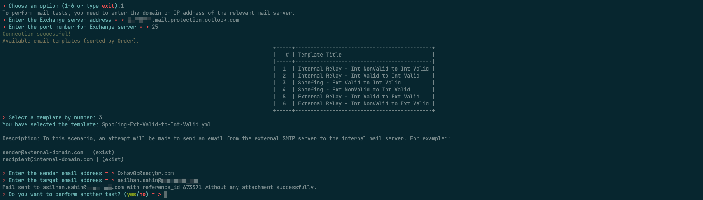
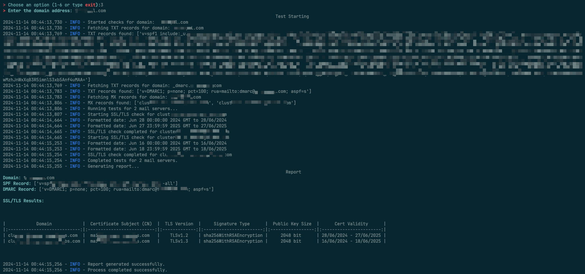
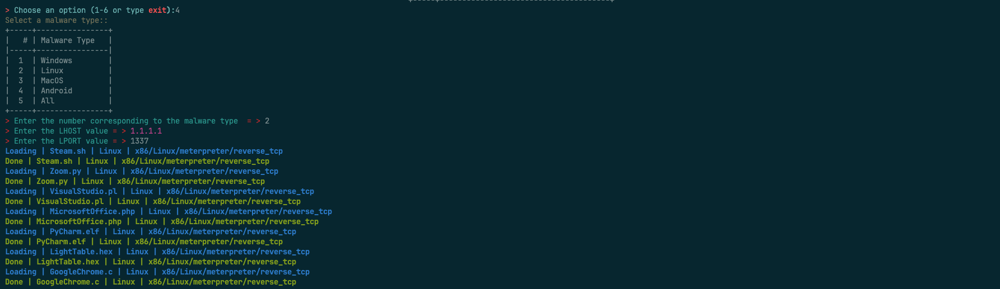
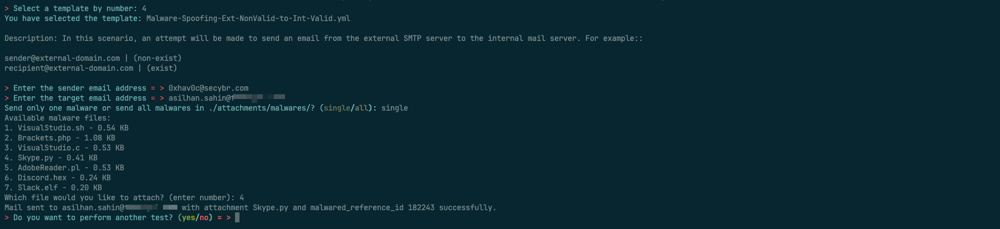
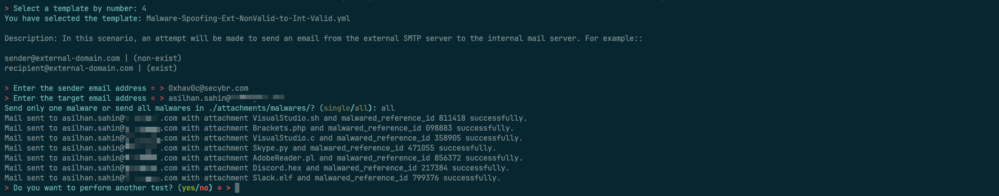
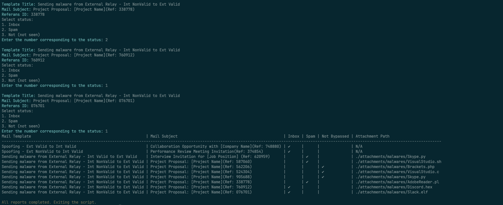

# MailSecOps
MailSecOps is an email and mail gateway security testing tool. With this script, you can perform mail spoofing, relay tests and security checks for a specific domain. The tool also helps to verify SPF, DMARC, SSL/TLS and other security tests.

MailSecOps was developed to perform Manual Device Inspection Evasion Bypass tests, especially in Breach Attack Simulation (BAS) processes. MailSecOps is designed to test the security of the mail infrastructure (Mail Server, Mail Server + Mail Gateway etc.) and to detect possible security vulnerabilities. Today, many organizations use advanced filtering and security measures to protect their mail infrastructures against malware, phishing scenarios, relays and spoofs. However, bypassing these security measures, especially discovering vulnerabilities overlooked in manual audits, still presents an opportunity for attackers.

With this tool, you can simulate various attack vectors against the mail infrastructure, evaluate threats such as phishing, spam, malware and spear-phishing, and test how resistant your infrastructure is to such attacks. The tool specifically targets security layers such as Mail Filtering, Spam Detection, URL Scanning, and conducts tests aimed at bypassing existing defense systems and manual control methods used.

This tool helps organizations strengthen their firewalls more effectively by allowing security professionals to identify weak points in their email infrastructure and simulate attacks that could be launched through those points.

## How to Work?
The MailSecOps tool is designed to perform spoofing (spoofing) and relay (transmission via a proxy) tests on SMTP servers. In order for these functions to work correctly, the tool must first provide direct access to the target SMTP server.

### SMTP Server Access Requirements
In order for the spoofing and relay tests to be successfully executed, MailSecOps must be able to access the standard ports of the target SMTP server:

* Port 25: Traditional email transfer protocol port.
* Port 465: Port used for secure email sending over SSL/TLS.
* Port 587: Preferred port for modern and secure SMTP communication.

Therefore, it is mandatory for the device that will run MailSecOps to have access to the above-mentioned ports. Without access to the relevant ports, spoofing and relay tests will not be possible.

### Malware Sending Function and Working Principle
MailSecOps’s Malware Send function plays a critical role in email-based malware testing. This function uses spoofing and relay mechanisms while performing the email sending process.

MailSecOps is a powerful tool for performing comprehensive security testing on SMTP servers. However, for the tool to work effectively, appropriate access to the target server is a critical prerequisite. Tests performed without providing an environment that complies with the requirements may yield misleading results or may fail completely.


## Features
* Mail Spoofing and Relay Tests: Tests the domain name for mail spoofing and relay vulnerabilities with the templates it contains. You can edit these templates as you wish. In this way, you can verify which of the emails you send are inbox, spam or never reached according to the templates.
* Malicious File Sending: Sending malicious files via spoofing or relay
* SPF and DMARC Record Checks: Verifies that email security policies are configured correctly by checking the SPF and DMARC records of the domain name.
* SSL/TLS Checks: Examines the SSL/TLS certificate and security level on mail servers.
* Unique Reference ID: A unique Reference ID is sent for each e-mail sent. This provides convenience during the reporting phase.
* Reporting: With MailSecOps, every email you send is logged and a report is created by getting your input during the reporting phase.
* Malware Create: With the help of msfvenom, you can create malicious files under ./attachments/malwares/. You can also send your custom malware files by moving your own malware to the ./attachments/malwares/ directory if you wish.
## Installation
```console
git clone https://github.com/0xhav0c/MailSecOps.git
cd MailSecOps
pip install -r requirements.txt
```
## Usage
```console
python3 MailSecOps.py
```







## Requirements
* Python 3.6 or later
* colorama~=0.4.6
* termcolor~=2.4.0
* PyYAML~=6.0.2
* tabulate~=0.9.0
* dnspython~=2.7.0

## Development Goals

The primary objective of MailSecOps is to enhance the security of email infrastructures and identify potential vulnerabilities. While the tool already provides robust testing capabilities, future development goals aim to expand its functionality and cater to a broader audience:

* Send Phishing mails 
* Send Ransomwares mails
* Web Isolation Bypass methods
* Send mail (Not spoof or relay)

## Contribute
If you would like to contribute to the project or provide feedback, please create a pull request or open an issue.
